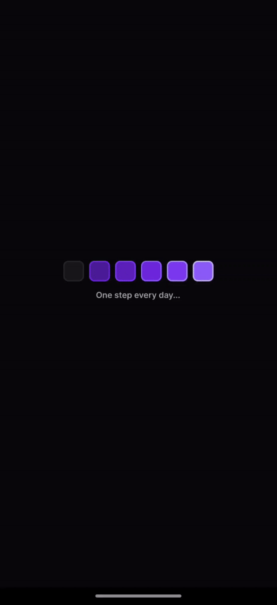

<!-- PROJECT LOGO -->
<br />
<p align="center">
  <a href="https://rock-seat-nlw-habits-app.vercel.app/">
    
  </a>
  
  <p align="center" style="color:#8FBC8B; font-size:25px">
    Habits Control
    <br />
  </p>
</p>

<hr>

<p align="center">
  <!-- <span style="color:#66FF00; font-size:25px">Brinque</span> -->
<a href="https://rock-seat-nlw-habits-app.vercel.app/" style="color:#66FF00; font-size:25px">
    Teste o projeto! Link do deploy 📝✅
  </a>
   </p>

<!-- Índice -->
# Índice

* [Sobre o projeto](#sobre-o-projeto)
* [Tecnologias utilizadas](#tecnologias-utilizadas)
* [Rodando localmente](#rodando-localmente)

<br>

<!-- Sobre o projeto -->
# Sobre o projeto
<div style="font-size:16px"><p>Aplicacão desenvolvida durante o evento NLW da Rocketseat, que ocorreu de forma online durante uma semana inteira, em janeiro de 2023.</p>
<p>Este foi meu primeiro contato com Prisma, Fastify, Vite, React Native, Tailwind CSS, Zod e Expo.</p>
<p>
Trata-se de um app de controle de hábitos, onde é possível criar hábitos, concluí-los e acompanhar seu progresso dia a dia.
</p>

Foram criadas duas versões: `Web` e `Mobile`.

<details>
<summary><strong>👨‍🔧 Desafios e melhorias encontrados no caminho ⚙️</strong></summary><br />

  Após a conclusão do evento, algumas mudanças foram incluídas no projeto, como:
  * Opção de excluir hábitos existentes.
  <br>
  (Implementado o método HTTP `delete`, e a atualização dos hábitos restantes no banco de dados);
  <br>

  * Possibilidade de voltar para a tela inicial tanto pelo botão ← (voltar) do app quanto pelo botão físico do celular na versão mobile.
  <br>
  (Implementada com o uso da API `BackHandler` do React Native);
  <br>

  * Barra de progresso se deformava se a quantidade de hábitos concluídos ultrapassasse o total já registrado.
  <br>
  (Solucionado com o uso de porcentagem nos atributos de CSS);
  <br>

  * Mudança do banco de dados de SQLite para PostgreSQL.
  <br>
  (Houveram grandes dificuldades para realizar o deploy da aplicação, pois o banco original utilizado era SQLite. Por isso, apesar de nunca ter usado, migrei o servidor para PostgreSQL, o que possibilitou o deploy do back-end);

</details>

<br>

# Tecnologias utilizadas
Essas foram as ferramentas utilizadas durante o desenvolvimento do projeto:

<table>
  <tr>
    <td valign="top">
      <h3 align="left">Server</h3>
      <ul>
        <li>Node</li>
        <li>Fastify</li>
        <li>Prisma</li>
        <li>PostgreSQL</li>
        <li>Typescript</li>
        <li>Zod</li>
      </ul>
    </td>
    <td valign="top">
      <h3 align="left">Web</h3>
      <ul>
        <li>React</li>
        <li>Typescript</li>
        <li>Vite</li>
        <li>Tailwind CSS</li>
      </ul>
    </td>
    <td valign="top">
      <h3 align="left">Mobile</h3>
      <ul>
        <li>React Native</li>
        <li>Typescript</li>
        <li>Expo</li>
        <li>NativeWind</li>
      </ul>
    </td>
  </tr>
</table>

<!-- Rodando localmente -->
# Rodando localmente

### Iniciando o projeto:
1. Clone o repositório em uma pasta de seu computador:
```sh
git clone git@github.com:mathlaza/RockSeat_NLW_Habits_App.git
```
2. Entre na pasta raiz do projeto e depois na pasta `web`:
```sh
cd RockSeat_NLW_Habits_App/ && 
cd web
```
3. Instale as dependências:
```sh
npm install
```
4. Rode a versão Web e clique no link gerado no terminal:
```sh
npm start
```
### <p>Para a versão mobile:</p>

5. Entre na pasta `mobile`:
```sh
cd .. && cd mobile
```
6. Instale as dependências:
```sh
npm install
```
7. Rode a versão Mobile e gere o QR Code no terminal:
```sh
npm start
```
8. Baixe o aplicativo `Expo Go`, abra-o e clique em `Scan QR code` para escanear o código QR gerado no passo anterior. Após isso, o app estará conectado!
